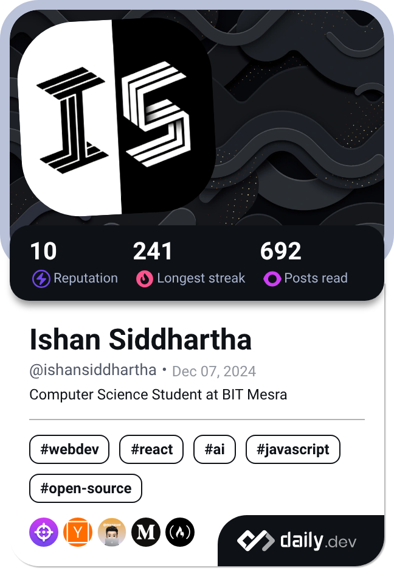

<h1 align="center">
    
</h1>

<h3 align="center">DEVELOPER</h3>

 

 
 🌱 I’m currently learning **Firebase, Next.js, TypeScript, devOps, System Design**

 👨‍💻 All of my projects are available at [ishan-siddhartha.vercel.app](https://ishan-siddhartha.vercel.app)

 📝 regularly active on [daily.dev](https://app.daily.dev/ishansiddhartha)

 💬 Ask me about **react, python, c++**
 
 

 

 
  
      
  
  <a href="https://ishan-siddhartha.vercel.app" target="_blank">
      <!-- sqlite, safari, google-chrome are other good icon options -->
  </a>

 

<h3 align="center">Connect with me:</h3>
<table align="center">
  <tr>
    <!-- Left column: DevCard -->
    <td valign="top">
      
    </td>
    <!-- Right column: Social Icons Grid -->
    <td valign="top">
      <table>
        <tr>
          <td>
            
          </td>
          <td>
            
          </td>
          <td>
            
          </td>
        </tr>
        <tr>
          <td>
            
          </td>
          <td>
            
          </td>
          <td>
            
          </td>
        </tr>
        <tr>
          <td>
            
          </td>
          <td>
            
          </td>
          <td>
            
          </td>
        </tr>
      </table>
    </td>
  </tr>
</table>

 

 
<h2 align="center">⚒️ Languages-Frameworks-Tools ⚒️</h2>
 

    
    

     

 

<h2 align="center">⚡ Stats ⚡</h2>
 

 

 

  
  
   
  

  

<h3 align="center">
    
</h3>

 

